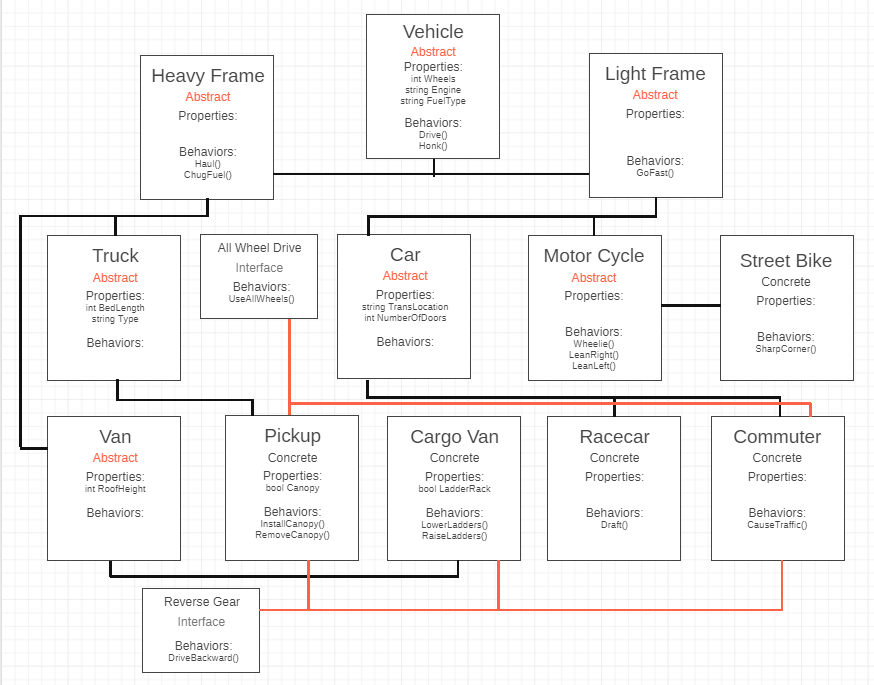

# .NET Motors
#### Lab05-DotNetMotors
##### *Author: Daniel Logerstedt*

------------------------------

## Description
This is a C# collection of Abstract and Concrete classes containing three levels of abstraction.

##### Interfaces
Interfaces are a way for us to attach similar behavior across many objects that do not share a parent object type and have sibling objects that don't share it.

I have 2 interfaces: DriveBackward and AllWheelDrive

DriveBackward is implemented in Commuter Cars, Pickup Trucks, and Cargo Vans. This is because Racecars and Motorcycles cannot drive backward.

AllWheelDrive is implemented in Commuter Cars and Pickups. It includes all methods of all wheel driving such as 4 wheel drive and standard all wheel drive. Racecars, Motorcycles, and Cargo Vans don't have this but Commuters and Trucks do.'

------------------------------

## Getting Started
Clone this repository to your local machine.
```
$ git clone https://github.com/daniellogerstedt/DotNetMotors.git
```
#### To run the program from Visual Studio:
Select ```File``` -> ```Open``` -> ```Project/Solution```

Next navigate to the location you cloned the Repository.

Double click on the ```DotNetMotors``` directory.

Then select and open ```DotNetMotors.sln```

------------------------------

## Visuals



------------------------------

## Questions

Create your own technical documentation. Breakdown and define each of the OOP principles in your own words.

##### Abstraction:

Abstraction is the act of creating a blueprint that defines a larger conceptual data types behaviors and properties. A good example of this in the lab work completed is a Vehicle which is the abstract blueprint of all of the other data types (including other abstract types) and defines the behaviors and properties that all of the other data types that inherit from it will have.

##### Inheritance:

Inheritance is when a class takes properties and behaviors from a parent class, whether Abstract or Concrete. Behaviors inherited from a parent class can be overridden if the behavior needs to be modified to fit the child class. A good example of this is Motor Cycles in my lab, which cannot Honk so they override the Honk behavior of their parent class to do nothing.

##### Encapsulation:

Encapsulation is the concept of being able to access all of the parent class properties and behaviors from one location rather than needing to reference the parent class to use these.

##### Polymorphism:

Polymorphism is the ability for a class to be used in place of any data that requires a parent or interface it inherits or implements.
For example Cars and Trucks can be referenced in place of a Vehicle because they are both Vehicles as they inherit fron the Vehicle class.

##### Interfaces

Interfaces are a blueprint that defines what behaviors any class implementing them must have. The act of implementing an interface is acceptance of the required behaviors that interface contains. My lab has 2 interfaces that are defined: IDriveBackward and IAllWheelDrive. These interfaces were chosen because not all vehicles can drive backward, however the behaviors are something that can be performed certain Vehicles contained within certain sub classes can do, for example Racecars cannot drive backward, but Commuter cars can and Trucks can.


------------------------------

## Change Log
1.0.1: Updated ReadMe with Questions required by Labs.
